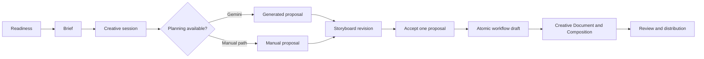
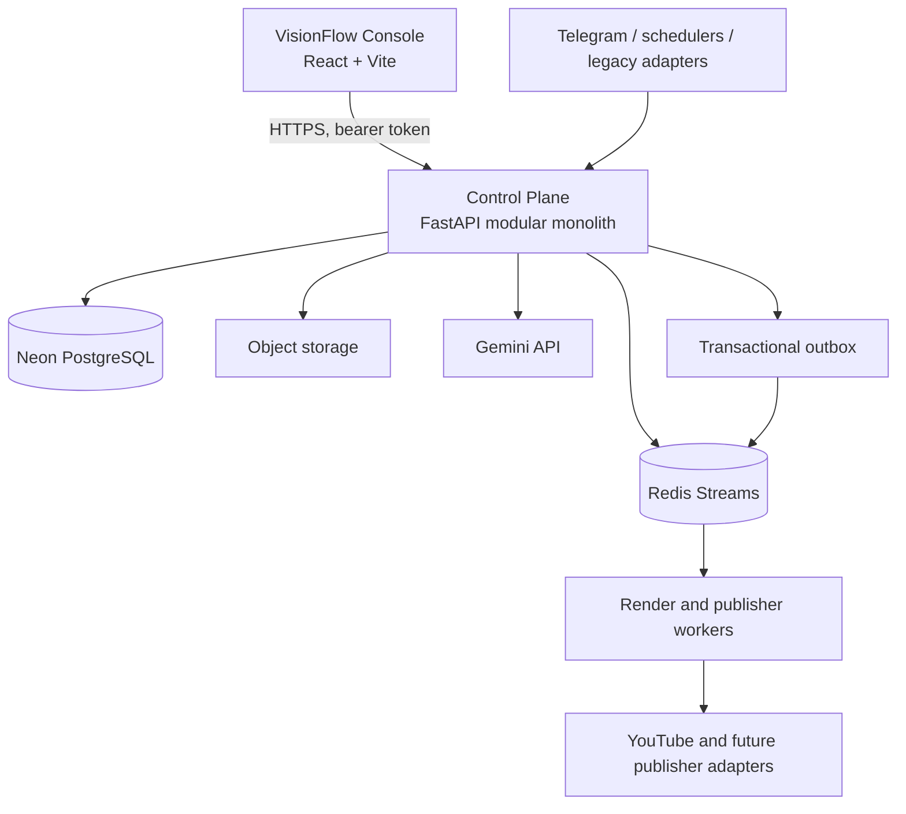

# VisionFlow

**VisionFlow** is an operator-led AI video operating system for creating, reviewing, rendering, and distributing short-form video. It replaces the former Telegram-only workflow with a secure web Control Plane while preserving adapters for legacy intake and execution paths.

V1 is intentionally optimized for **vertical short-form video**. Long-form is an architectural extension, not a production claim in this repository today.

> Production deployment guidance: [docs/DEPLOYMENT.md](docs/DEPLOYMENT.md).
> Security policy: [docs/SECURITY.md](docs/SECURITY.md).

## What operators can do today

- Sign in to the VisionFlow Console and work inside an organization boundary.
- Check creation readiness before starting a short-form workflow.
- Create a durable creative session from a brief, then plan with Gemini when a configured credential and promoted prompt baseline are available.
- Continue with a validated manual proposal when AI planning is unavailable.
- Edit storyboard proposals as immutable revisions, accept one proposal, and atomically create a workflow draft with a versioned Creative Document.
- Manage encrypted provider credentials, versioned prompt templates, review state, publishing connections, and publication history through the Control Plane.
- Use existing Telegram, scheduler, and worker paths as intake/execution adapters without making them the source of truth for the web workflow.

## Guided short-form journey



The manual path is a first-class production flow. A missing Gemini credential must block only AI planning; it must not prevent an operator from drafting a valid short-form workflow.

## Architecture



### Architectural rules

- **PostgreSQL Control Plane is the canonical state writer.** Workflow, creative, credential, prompt, approval, and publication state are owned there.
- **Modular monolith, not microservices.** Modules communicate through application ports, repositories, and transactional outbox events within this repository.
- **Organization isolation is mandatory.** Every operator-facing query and command is authorized against an organization membership.
- **Creative inputs are reproducible.** Proposal revisions and Creative Document versions are immutable snapshots; a selected proposal is not silently overwritten.
- **External side effects are isolated.** Rendering and publishing run behind worker/platform adapters; bot handlers do not render or publish directly.
- **Secrets stay server-side.** Provider credentials are encrypted at rest and browser environment variables never contain database, object-storage, signing, or LLM secrets.

## Repository map

| Path | Responsibility |
| --- | --- |
| `services/control-plane` | FastAPI API, SQLAlchemy models, Alembic migrations, organization authorization, creative sessions, prompt and credential vaults. |
| `services/publisher-worker` | Publication execution boundary and platform adapters. |
| `worker` | Media generation, rendering, audio, asset, and publishing execution workers. |
| `orchestrator` | Legacy Telegram intake, scheduling, queues, and compatibility adapters. |
| `shared` | Shared runtime contracts and assets. |
| `docs` | Operational and security documentation. |

## Production topology

| Concern | Production choice |
| --- | --- |
| Web console | Vercel-hosted VisionFlow Console |
| API | Render-hosted Control Plane |
| Canonical database | Neon PostgreSQL |
| Event transport | Redis Streams with transactional outbox relay |
| Files and media | Object storage adapter |
| AI planning | Gemini through the encrypted provider credential vault |

The free Render topology is suitable for API/control-plane preview and manual dispatch. Persistent rendering/publishing workers should be enabled only when the corresponding deployment tier and operational runbook are in place.

## Readiness and safe degradation

The Console asks the Control Plane for a short-form readiness snapshot before creation. It distinguishes:

- **Creation ready:** an operator can create a brief or manual proposal.
- **AI planning ready:** a Gemini credential and the promoted planner/director prompts are available.
- **Render prerequisites ready:** required media and storage integrations are available.
- **Render dispatch ready:** an execution runner is available for the selected environment.

This prevents the UI from promising an unavailable capability and gives the operator a direct remediation path instead of a mock action.

## Local development and verification

Use repository-specific environment files; never commit them. The Control Plane requires PostgreSQL URLs for runtime and Alembic migrations. The Console uses only public `VITE_*` values.

Primary checks:

```powershell
# Control Plane
python services/control-plane/scripts/test_postgres_disposable.py

# Console
cd ..\VisionFlow_Client
npm run lint
npm run test
npm run build

# Backend secret scan
cd ..\VisionFlow_Bakend
powershell -ExecutionPolicy Bypass -File scripts/security-scan.ps1
```

Run Alembic migrations deliberately against the target PostgreSQL environment before deploying a new Control Plane revision. The current creative-session migration head is `0016_creative_sessions`.

## Configuration boundaries

Document variable names in environment examples and deployment documentation only. Do not put values in issues, commits, screenshots, or README files.

- **Control Plane:** database, migration database, Redis, auth signing, encryption, storage, CORS, and worker identity configuration.
- **Console:** Control Plane URL, organization identifier, and public client settings only.
- **Gemini:** add credentials through the encrypted Provider Credential Vault. Environment fallback is intentionally opt-in and disabled for production by default.

## Current product boundary

| Included | Deliberately not claimed as complete |
| --- | --- |
| Guided short-form creation, manual fallback, AI planning integration, proposal acceptance, atomic draft creation | End-to-end long-form production workflow |
| Versioned creative documents and Composition handoff | A full desktop-style NLE/CapCut replacement |
| Organization authorization, credential vault, prompt registry, review and publishing foundations | Autonomous publishing without configured platform connection and approval policy |

## Contributing safely

Keep code changes inside existing module boundaries, preserve unrelated worktree changes, and run the relevant checks before committing. Review [AGENTS.md](AGENTS.md) before modifying orchestration, worker, publisher, or data-model behavior.
