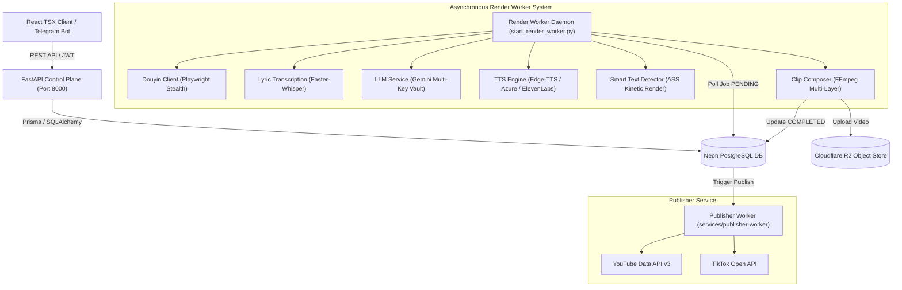
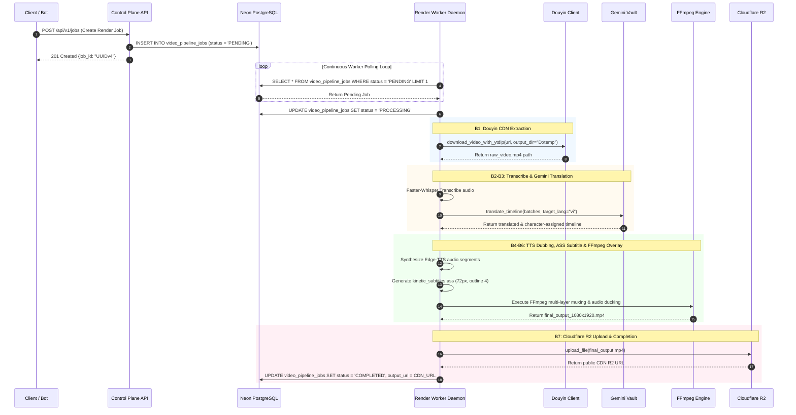

# 🏗️ 02. Backend Component Architecture & Pipeline Sequence Specs

## 🏛️ 1. Detailed Component Architecture Diagram

---

## ⏱️ 2. UML Sequence Diagram: Job Execution Sequence (B1 ➔ B7)

---

## 🛠️ 3. Pipeline Error Handling & Recovery Matrix

| Điểm Phát Sinh Lỗi | Nguyên Nhân Gốc | Giải Pháp Xử Lý Tự Động Trong Code |
| :--- | :--- | :--- |
| **Douyin Extract Fail** | CDN URL dính IP Rate Limit hoặc CAPTCHA | Chuyển sang Playwright Stealth headless browser giả lập hành vi người dùng, ép ghi ổ đĩa D:. |
| **Gemini API 429** | API Key hết Quota / Overused | `LLMService._get_gemini_keys()` giải mã và xoay sang Key dự phòng kế tiếp trong Postgres Vault. |
| **FFmpeg Filter Error** | Bản build FFmpeg không hỗ trợ `force_style` | `check_subtitles_supports_force_style()` kiểm tra động lệnh help, tự động cắt tỉa tham số `force_style` nếu không hỗ trợ. |
| **Drive C: Space Full** | Temp file của yt-dlp & Playwright phồng to | Ép toàn bộ biến `TEMP`, `TMP`, `TMPDIR` và `--paths temp:...` ghi trực tiếp sang **Ổ đĩa D:**. |
