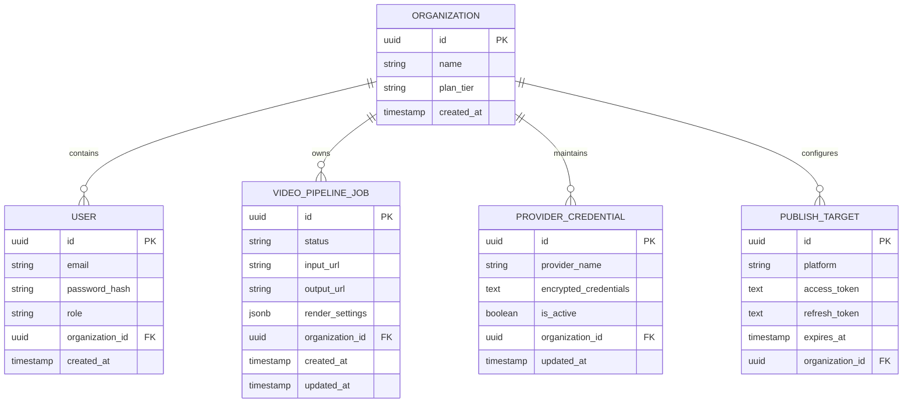

# 🗄️ 03. Database Data Models & Fernet Credential Vault Spec

## 📊 1. ERD (Entity Relationship Diagram)



---

## 🔒 2. Multi-Key Vault Encryption Specification

Tất cả thông tin nhạy cảm của người dùng (API Keys Gemini, Pexels, ElevenLabs, OAuth Tokens) được mã hóa ở cấp ứng dụng (Application-Level Encryption):

```python
# Sơ đồ mã hóa Fernet Vault trong Backend
hash_material = hashlib.sha256(VISIONFLOW_CREDENTIAL_ENCRYPTION_KEY.encode()).digest()
fernet_key = base64.urlsafe_b64encode(hash_material)
cipher = Fernet(fernet_key)

# Giải mã API key trong Worker
raw_json = cipher.decrypt(credential_record.encrypted_credentials.encode()).decode()
keys = json.loads(raw_json)
```

---

## 📑 3. Fast Indexing Strategy
- **Index `idx_jobs_status_org`**: Index phức hợp `(status, organization_id, created_at)` trên bảng `video_pipeline_jobs` giúp Worker Daemon poll job mới với thời gian phản hồi `< 2ms`.
- **Index `idx_credentials_active`**: Index `(provider_name, is_active)` giúp tải danh sách keys xoay vòng tức thì.
