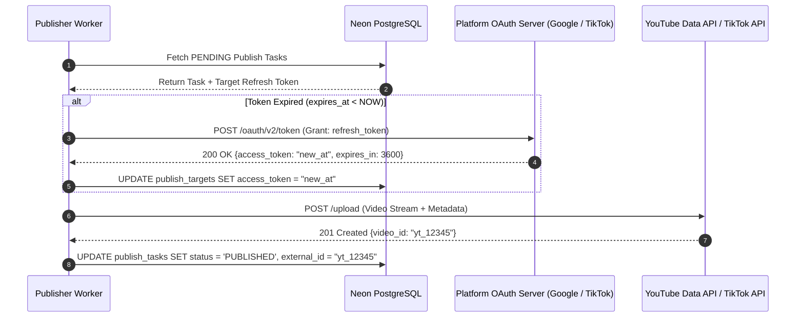

# 📢 04. Publisher Worker & Multi-Platform Social Media Integration

## 📌 1. Architecture Overview
`publisher-worker` (`services/publisher-worker/`) là microservice nền chịu trách nhiệm tự động đăng tải video hoàn chỉnh sau bước B7 lên các nền tảng mạng xã hội: **YouTube Shorts**, **TikTok**, và **Facebook Reels**.

---

## 🔄 2. OAuth Token Lifecycle & Auto-Refresh Sequence

---

## 🛠️ 3. Metadata Generation & Hashtags Injection
Publisher Worker tự động định dạng tiêu đề, mô tả và hashtags tối ưu SEO:
- **Title Optimization**: Giới hạn tối đa 100 ký tự (YouTube) / 2200 ký tự (TikTok).
- **Auto Hashtags**: Tự động chèn các hashtag xu hướng (`#Shorts`, `#Reels`, `#TikTokTrending`, `#VisionFlowAI`).
- **Privacy Status**: Hỗ trợ chế độ `public`, `unlisted`, hoặc `private`.
