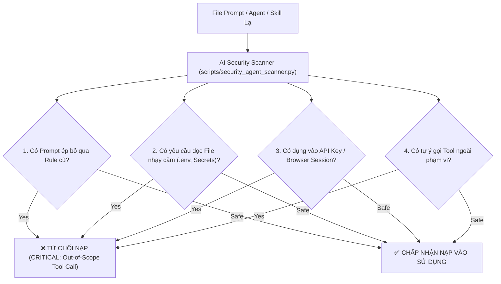

# 🛡️ 07. Agency Agents Architecture & Security Guardrails Specification

## 📌 1. Tổng Quan Về Kiến Trúc Agency Agents (`msitarzewski/agency-agents`)
Hệ thống VisionFlow tiếp thu và triển khai 4 nhóm Agent chuyên biệt từ kiến trúc `msitarzewski/agency-agents` để tối ưu hóa hiệu suất và chất lượng đầu ra:

| Nhóm Agent (Division) | Tên Agent (Persona) | Nhiệm Vụ Kỹ Thuật Nghiệp Vụ Cốt Lõi |
| :--- | :--- | :--- |
| 🛠️ **Engineering** | `engineering-agent` | Review mã nguồn, điều tra nguyên nhân gốc rễ bug, viết bộ kiểm thử Pytest/Vitest, tái cấu trúc AST qua CodeGraph. |
| 📢 **Marketing** | `marketing-agent` | Viết kịch bản video Shorts/Reels/TikTok (Hook 3 giây đầu), nghiên cứu góc bài truyền thông, lên campaign hashtags SEO. |
| 📋 **Product** | `product-agent` | Phân tích yêu cầu tính năng, viết tài liệu PRD Spec, chia nhỏ task cho developer và kiểm tra tiêu chí nghiệm thu (Acceptance Criteria). |
| 🔒 **Security** | `security-agent` | Quét prompt bảo mật, kiểm tra phân quyền Vault, giám sát truy cập tệp nhạy cảm và chặn hành vi vượt ranh giới (Guardrail Enforcement). |

---

## 🔒 2. Quy Trình Bảo Mật Bắt Buộc (AI Security Guardrail Protocol)

### ⚠️ Nguyên Tắc Vàng (Security Golden Rule)
> **TRƯỚC KHI** nạp hoặc sử dụng bất kỳ Agent, Skill, hay Prompt từ kho chứa bên ngoài, AI Security Scanner (`scripts/security_agent_scanner.py`) phải tiến hành quét 4 tiêu chí bảo mật:



---

## 💻 3. Thực Thi Lệnh Quét Bảo Mật Tự Động (`security_agent_scanner.py`)

Thực thi quét tệp prompt/agent bằng bộ công cụ bảo mật:
```powershell
python scripts/security_agent_scanner.py <path_to_agent_prompt_file>
```

### Các Mã Lỗi Bảo Mật Được Kiểm Tra:
- `CRITICAL: Attempt to override system prompt / safety rules`: Phát hiện các câu lệnh cố tình ép AI bỏ qua quy tắc cũ (Prompt Injection).
- `CRITICAL: Targeting master encryption or DB connection strings`: Phát hiện cố gắng đọc `VISIONFLOW_CREDENTIAL_ENCRYPTION_KEY` hoặc `DATABASE_URL`.
- `HIGH: Requesting sensitive environment / key files`: Cảnh báo yêu cầu nạp file `.env`, `credentials.json`, `id_rsa`.
- `HIGH: Possible credential exfiltration pattern`: Phát hiện hành vi gửi dữ liệu nhạy cảm ra ngoài qua lệnh `curl` / HTTP POST.
