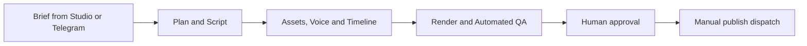
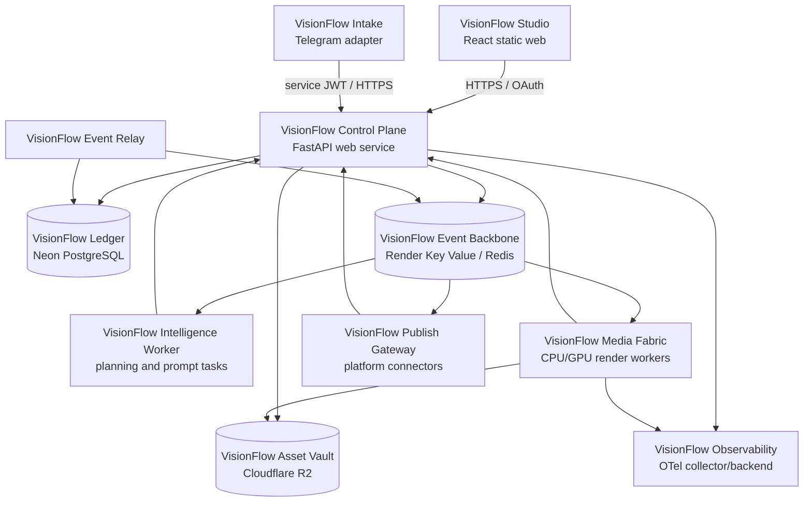

# VisionFlow — Production Architecture

**Status:** Approved target architecture
**Product name:** VisionFlow
**Initial release:** V1 Short-form Studio
**Deployment:** Render + Neon PostgreSQL + Render Key Value + Cloudflare R2
**Primary repository:** `AgentTiktok` (to be renamed to `visionflow` when the repository is clean)

All implementation work is governed by [VisionFlow Engineering Standards](VISIONFLOW_ENGINEERING_STANDARDS.md). Architectural principles are enforced through dependency rules, contract tests, review gates and release checks—not documentation alone.

The frontend experience is governed by [VisionFlow Prism Flow UI System](VISIONFLOW_UI_SYSTEM.md): cinematic and spatial where it improves comprehension, but fully accessible and operational without WebGL.

## 1. Product definition

VisionFlow is an **AI Video Operating System**: a governed production system that converts an approved brief into an auditable, reviewable and publishable video. It is not merely an AI prompt-to-video screen.

V1 delivers the complete **on-demand short-form** operating loop:



The data model, command contracts and media timeline are designed for **long-form** from day one. Long-form is deliberately inactive in V1; enabling it later adds workflow templates and worker capacity, not a second architecture.

### V1 scope freeze

V1 accepts one brief at a time and produces one short-form workflow run. It includes prompt governance, Script → Storyboard → Asset/Voice → Render → QA, signed preview, mandatory approval and a manually dispatched publication. The complete inclusion/exclusion list is maintained in [VisionFlow V1 Scope Freeze](VISIONFLOW_V1_SCOPE.md).

## 2. Architecture decisions

| Decision | Chosen approach | Reason |
| --- | --- | --- |
| Product boundary | One canonical VisionFlow repository | Prevents the current parallel BackendAgent/ClientAgent/AgentTiktok systems from owning the same jobs and data. |
| Application shape | Modular monolith control plane plus independently deployable adapters and workers | Keeps V1 operable while isolating CPU/GPU, Telegram and publisher concerns. |
| Public API and data owner | `visionflow-control-plane` (FastAPI, SQLAlchemy 2, Alembic) | The existing Studio already consumes this API shape; one service owns PostgreSQL writes and policy. |
| Telegram | `visionflow-intake` adapter | Telegram remains valuable, but calls the control-plane API with a service identity and never writes the database directly. |
| Async transport | Redis Streams with consumer groups, transactional outbox and dead-letter streams | Language-neutral commands let Node adapters and Python workers communicate without BullMQ/Python coupling. |
| System of record | Neon PostgreSQL | Strong relational workflow state, JSONB prompt/timeline metadata and safe environment branches. |
| Runtime database access | Pooled Neon URL for application traffic; direct Neon URL only for Alembic migrations | Neon recommends pooling for concurrent application traffic and a direct connection for ORM migrations. |
| Media storage | Cloudflare R2 private buckets | Video files are objects, not database blobs or Render disks; S3-compatible APIs preserve provider portability. |
| Render execution | GPU job-runner abstraction behind `RenderProvider` | V1 can route short jobs to a GPU provider while the control plane stays on Render; long-form can add capacity without API changes. |
| Publish policy | Mandatory human approval in V1 | Protects brand, platform accounts, music rights and prompt quality. |

## 3. System topology and service names



| Component | Render type | Responsibility | Must not do |
| --- | --- | --- | --- |
| VisionFlow Studio | Static site | Creator and administrator UI, direct-to-R2 upload with signed URLs | Hold provider secrets or mutate state outside API contracts |
| VisionFlow Control Plane | Web service | REST API, auth, policy, PostgreSQL transactions, prompt governance, signed-media URLs, event outbox | Render video or invoke browser automation |
| VisionFlow Intake | Background worker | Telegram conversations and command translation | Access PostgreSQL or Redis directly |
| VisionFlow Event Relay | Background worker | Publish transactional outbox records to Redis Streams and retry delivery | Apply workflow business rules |
| VisionFlow Intelligence Worker | Background worker | Research, planning, script, storyboard and prompt execution | Publish content or own workflow state |
| VisionFlow Media Fabric | External GPU/CPU job runner | Assets, TTS, compositing, subtitle, QA and export | Serve public HTTP or retain permanent media |
| VisionFlow Publish Gateway | Background worker | Approved platform publication and analytics ingestion | Bypass the approval gate |

Render disks are not part of this design. Their data is not shared between services and attaching one prevents horizontal scaling; R2 is the durable media boundary. See [Render persistent disk limitations](https://render.com/docs/disks).

## 4. Domain modules and patterns

The control plane remains one deployable application, divided into bounded modules. Each module owns its application services, validation and repository interface.

| Module | Responsibilities | Key patterns |
| --- | --- | --- |
| Identity and tenancy | users, organizations, roles, service identities, sessions | RBAC policy, token rotation |
| Project workspace | brief, brand kit, format, target channels and approvals | Aggregate root: `VideoProject` |
| Workflow | run, step, attempt, state transitions, retries and cancellation | Explicit state machine, Command pattern, Saga-style compensation |
| Prompt intelligence | templates, versions, evaluations, promotion and rollback | Registry, immutable versions, Strategy per agent |
| Media catalog | upload intents, assets, derived assets, checksums and retention | Repository + Adapter for R2 |
| Timeline and render | scenes, tracks, edit decisions, render profiles, exports | Timeline DSL, Factory for render engine, Strategy for short/long templates |
| Distribution | publish targets, approval, platform credentials, delivery attempts | Adapter per platform, Outbox for delivery commands |
| Analytics | collection, normalized performance events and reports | Anti-corruption layer for external platform APIs |

### Agent roles

Agents are capabilities, not autonomous database owners. Every agent receives a typed input, a pinned prompt version and an idempotency key; it writes output through the workflow command API.

1. **Brief Analyst** normalizes creator intent and constraints.
2. **Research Agent** retrieves permitted source material and records citations.
3. **Script Agent** creates hook, voice script and CTA.
4. **Storyboard Agent** converts the script into scenes and a timeline plan.
5. **Visual Director** chooses a style, B-roll query and asset requirements.
6. **Audio Director** selects TTS, music and mix parameters.
7. **Editor Agent** produces edit-decision instructions, not an opaque final video.
8. **QA Agent** validates duration, aspect ratio, subtitle coverage, loudness, forbidden content and asset rights declarations.
9. **Publish Agent** prepares platform metadata only after QA and approval.
10. **Analytics Agent** is a post-V1 capability; it will turn published metrics into planning feedback only after reliable publication data exists.

## 5. Data, commands and workflow state

### Canonical PostgreSQL model

New tables use UUID primary keys, `timestamptz`, JSONB and explicit ownership. Legacy numeric identifiers are retained only in `legacy_*` mapping columns during migration.

| Aggregate | Essential tables | Notes |
| --- | --- | --- |
| Identity | `organizations`, `users`, `organization_memberships` | Implemented in initial V1. Roles: administrator, producer, reviewer, viewer. |
| Project | `video_projects` | Implemented in initial V1; the validated brief is stored with its project and V1 only accepts `short_vertical`. |
| Workflow | `workflow_runs`, `workflow_steps`, `outbox_events` | Implemented in initial V1. The run idempotency key and row-locked transitions make retries traceable. |
| Prompt governance | `prompt_templates`, `prompt_versions`, `prompt_audit_events` | Append-only versions, explicit production promotion and actor-attributed audit records. |
| Media | `media_assets` | Implemented metadata boundary; files live in R2, never in PostgreSQL. |
| Distribution | `publish_approvals` | Implemented approval record; targets/connections/attempts are introduced only with the manual publish gateway. |
| Analytics | Post-V1 extension | Not part of the short-form creation critical path. |

### Command envelope

The Event Relay converts each transactional outbox record into this JSON message shape on `visionflow.commands`:

```json
{
  "event_id": "uuid",
  "event_type": "visionflow.render.requested.v1",
  "occurred_at": "2026-07-15T10:00:00Z",
  "trace_id": "w3c-trace-id",
  "organization_id": "uuid",
  "workflow_run_id": "uuid",
  "step_id": "uuid",
  "attempt": 1,
  "idempotency_key": "stable-string",
  "payload": {}
}
```

Consumers acknowledge only after the step result is committed. Permanent errors move the message to `visionflow.dead-letter`; retryable errors use bounded exponential backoff. The outbox record is created in the same PostgreSQL transaction as the state transition, so a successful API response cannot silently lose its command.

### V1 short-form state machine

```text
DRAFT → READY → QUEUED → PLANNING → SCRIPTED → STORYBOARDED → ASSETS_READY
→ RENDERING → QA_PENDING → RENDERED → APPROVAL_PENDING
→ APPROVED → PUBLISHING → PUBLISHED

Any active state → RETRY_SCHEDULED | CANCELED | FAILED
```

The only allowed transition to `PUBLISHING` is an approved, QA-passed render with a valid output asset. Long-form uses the same state machine, with additional planning/render steps inside the workflow run.

### Object layout and retention

```text
org/{organization_id}/project/{project_id}/job/{workflow_run_id}/
  source/{asset_id}
  derived/{asset_id}
  preview/{export_id}.mp4
  final/{export_id}.mp4
  metadata/{timeline_version}.json
```

Studio uploads only by a short-lived, content-type-restricted signed PUT URL. Preview/download access uses short-lived signed GET URLs. Hash every completed upload, virus-scan user uploads before worker use, and apply R2 lifecycle deletion to transient assets.

## 6. Runtime interfaces

The public API is versioned at `/api/v1`. The existing cockpit endpoints are migrated behind these stable resources rather than exposing database tables.

| Interface | Core operations |
| --- | --- |
| `POST /projects` | Create a project and short/long format brief. |
| `POST /projects/{id}/runs` | Validate, pin prompt versions and create a workflow run. |
| `GET /runs/{id}` and `/events` | Fetch status and server-sent progress events; Studio reconnects using `Last-Event-ID`. |
| `POST /assets/upload-intents` | Request a signed upload URL; client confirms checksum after upload. |
| `GET/POST /prompts/*` | Draft, evaluate, compare, promote and roll back prompt versions. |
| `POST /exports/{id}/approve` | Record a human approval; requires QA pass. |
| `POST /publish-targets/{id}/dispatch` | Enqueue an approved publication; never uploads synchronously. |
| `POST /internal/v1/events/step-result` | Worker-only result callback authenticated by a scoped service token. |

Breaking API changes require `/api/v2`; additive fields are backwards-compatible. Generated TypeScript types are published from the OpenAPI document into `packages/api-contracts`, keeping Studio and Telegram inputs aligned.

## 7. Security, safety and observability

### Required production controls

- Replace the current environment-admin login with database-backed users, Argon2id password hashes, token rotation/revocation and rate limits. Add MFA for owner/admin before enabling public access.
- Use Render secret groups and environment-specific secrets; no default passwords, `.env` files, provider tokens or browser profiles in Git or Docker images.
- Use scoped service principals: Intake can create/query projects; workers can report only their own step results; Publisher can use encrypted platform credentials only after approval.
- Encrypt platform refresh tokens and API keys with envelope encryption; record access in an audit event.
- Verify all uploaded MIME types, sizes and checksums; never trust filenames or browser-supplied media metadata.
- Require explicit rights confirmation for music and assets. Preserve source and license metadata with each media asset.
- Add CORS allow-lists, security headers, CSRF protection for cookie-based sessions, request size limits and signed webhook verification where applicable.
- Apply OWASP ASVS 5.0 Level 2 as the release security checklist. [OWASP ASVS](https://owasp.org/www-project-application-security-verification-standard/)

### Observability contract

All services emit OpenTelemetry traces, metrics and structured logs. Propagate W3C trace context through API calls and command envelopes. Required attributes are `organization_id`, `project_id`, `workflow_run_id`, `workflow_step_id`, `prompt_key`, `prompt_version`, `render_profile` and `provider`.

Minimum dashboards and alerts:

- API availability, p95 latency, HTTP 5xx and authentication failures.
- Queue depth, oldest pending command, dead-letter count and retry exhaustion.
- Workflow success rate, render duration/cost, QA failures and publish failures by provider.
- Neon connection saturation, query errors and migration status.
- R2 upload failures, storage growth and expired-object cleanup.

OpenTelemetry is vendor-neutral and correlates traces, metrics and logs across services. [OpenTelemetry concepts](https://opentelemetry.io/docs/concepts/)

## 8. Production environments and release flow

| Environment | Purpose | Data | Deployment trigger |
| --- | --- | --- |
| Local | Developer iteration | Docker PostgreSQL/Redis/MinIO-compatible storage; fake providers | Local scripts |
| Staging | End-to-end validation | Dedicated Neon staging branch, staging R2 bucket and non-production platform accounts | Merge to `main` after CI |
| Production | Customer operations | Dedicated Neon production branch, production R2 bucket and real secrets | Version tag + protected environment approval |

Use the Neon pooled URL for running services and `MIGRATION_DATABASE_URL` (direct) only for Alembic. Do not restore a staging branch over a live production branch because production writes after the snapshot can be lost; production receives forward-only, reviewed migrations. [Neon pooling](https://neon.com/docs/connect/connection-pooling), [Neon promotion caveat](https://neon.com/blog/promoting-postgres-changes-safely-production)

Release sequence:

1. Pull request runs local-equivalent verification in GitHub Actions.
2. Merge to `main` deploys immutable images to staging, runs one migration job, then executes API and browser smoke tests against staging.
3. A release tag produces a release candidate. The production environment requires an approver.
4. Production runs backup verification, forward migration, deployment, readiness checks and synthetic short-form job creation with publishing disabled.
5. Enable traffic only after health, error budget and queue checks are green; rollback application image separately from database schema.

GitHub Actions uses least-privilege `permissions`, protected environments and full commit-SHA action pins. Full SHAs are the immutable pinning model recommended by GitHub. [GitHub Actions secure use](https://docs.github.com/en/actions/reference/security/secure-use)

## 9. Migration from the current workspace

The current workspace contains a React Cockpit and FastAPI API outside the Git repository, plus an AgentTiktok repository with direct MySQL/Prisma/BullMQ and a Python worker. This is a consolidation, not an in-place connection-string change.

1. Create the VisionFlow monorepo layout and move the Cockpit source with history preserved where available.
2. Freeze new MySQL schema changes; take a verified MySQL export and media manifest before any cutover.
3. Build the PostgreSQL schema with Alembic; migrate legacy records into staging with ID mapping, UTC conversion and JSON validation.
4. Move all FastAPI direct SQL and all worker `pymysql` access behind SQLAlchemy repositories. Remove Prisma as a database writer after Telegram has moved to the API adapter.
5. Introduce the outbox and Redis Stream consumers; operate dual-read validation in staging, never dual-write production business state.
6. Move files from local worker paths to R2, rewrite database references to immutable object keys and validate checksums.
7. Cut over production in a maintenance window: stop intake, drain jobs, final export, migrate, reconcile counts/checksums, deploy, run smoke workflow, then re-enable intake.
8. Keep the legacy MySQL backup read-only for the agreed retention period; delete only after reconciliation and restore rehearsal pass.

## 10. Acceptance criteria

VisionFlow V1 is ready for production only when all of these are demonstrably true:

- A creator can make a short-form project in Studio or Telegram and see the same workflow state in both surfaces.
- A run pins prompt versions, creates an auditable command chain, survives a worker restart and never renders/publishes twice for the same idempotency key.
- A rendered export is stored in R2, QA-gated, previewable by a signed URL and cannot publish until a reviewer approves it.
- PostgreSQL is Neon-backed in staging and production; no service keeps MySQL/PyMySQL/Prisma as a production write path.
- Render API and workers have readiness checks, correct least-privilege secrets and no Docker socket or persistent browser profile dependency.
- Local verification and GitHub Actions both pass type checks, unit/contract tests, migration validation, secret scanning, API smoke tests and browser E2E smoke tests.
- Dashboards show a full trace from project creation to worker completion; an alert is tested for worker failure and dead-letter growth.
