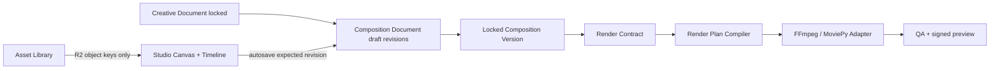

# VisionFlow Composition Studio — Next Phases

**Status:** execution specification for agents

**Scope:** the short-form Composition Studio after the existing `creative_documents` and `composition_*` snapshots.

**Non-goal:** clone CapCut feature-for-feature. VisionFlow is an AI-video operating system: every edit must be durable, organization-scoped, reproducible by a worker, and attributable to a locked snapshot.

## 1. Current baseline and truthful limits

Already implemented:

- versioned timeline persistence (`CompositionDocument → CompositionVersion → Track → Clip → Effect → Keyframe`);
- optimistic revision checks and locked snapshots before queueing;
- video-track order and duration materialized by the render dispatcher;
- supported renderer effects: cinematic push, impact shake, caption pop, soft glow, motion blur, transform, and scale keyframes;
- React Composition Studio calls the Control Plane API instead of storing a fake timeline.

Still incomplete:

1. **Overlay and caption tracks are persisted but not yet composited as arbitrary media.**
2. **Audio tracks are persisted but not yet mixed by per-clip timing, gain, fades, and ducking.**
3. **The canvas is a layout preview, not a server-rendered media preview.**
4. **Keyframe editing is limited to scale; no curve editor, transform handles, or multi-property keyframe UI exists.**
5. **Native drag/drop has no full keyboard command model, undo/redo history, or autosave scheduler.**

Do not call any of these items complete merely because the UI has a button.

## 2. Target architecture

### Ownership boundaries

| Module | Owns | Must not do |
| --- | --- | --- |
| Studio | interaction state, keyboard commands, request DTOs, local undo history | render media, trust client state as locked |
| Control Plane | tenancy, validation, revisioning, lock policy, outbox event | decode media or compose frames |
| Render-plan compiler | transform a locked composition into provider-neutral render operations | query PostgreSQL directly |
| Render provider adapter | execute FFmpeg/MoviePy/WebGPU implementation | change workflow state directly |
| Asset service | media metadata, signed URLs, source rights | expose storage credentials to browser |

`RenderPlanCompiler` is the next required abstraction. It receives a locked composition and emits a typed plan such as `VideoLayer`, `ImageLayer`, `TextLayer`, `AudioLayer`, `Transition`, and `KeyframeCurve`. Render providers implement a Strategy for that plan. Do not add more `if effect_key == ...` checks in routers or React.

## 3. Phase order and acceptance criteria

### Phase A — Render plan compiler and typed effect registry

**Why first:** the current renderer has a legacy sequential-scene boundary. A typed plan isolates future FFmpeg, MoviePy, GPU, and cloud render engines.

Deliverables:

- `worker/domain/composition_render_plan.py` with immutable dataclasses/value objects;
- `RenderPlanCompiler` application port and an adapter that compiles one locked composition version;
- `EffectDefinition` registry with key, target kinds, JSON schema, renderer capability, version, and deprecation state;
- Control Plane validation rejects unknown effects/configuration before persistence;
- `render_plan_hash` (SHA-256 canonical JSON) recorded in `RENDERING` step output.

Acceptance:

- identical locked snapshots compile to byte-identical canonical JSON/hash;
- unknown effect key/config returns 422 before a revision is created;
- renderer receives only typed plan objects, never raw unvalidated JSON;
- unit tests cover valid/invalid effect config, plan determinism, and backward-compatible registry versioning.

### Phase B — Real overlay, caption and audio tracks

Deliverables:

- asset picker backed by `MediaAsset` and signed preview URLs;
- clip `source_ref` must reference a media object or explicit generated text payload; file-system paths are forbidden;
- FFmpeg filtergraph adapter for overlay/scale/crop/alpha/trim and `xfade`; retain MoviePy as a controlled fallback only;
- audio clip properties: `gain_db`, `fade_in_ms`, `fade_out_ms`, `duck_against_voice`, `loop`; 
- captions compile to text/image layers using a controlled font registry.

Acceptance:

- an overlay at `timeline_start_ms=1000` appears only from 1s onward;
- audio ducking is measurable against voice-over and does not clip;
- missing asset fails before render with a typed error and no partial export;
- every media input is organization-scoped and rights metadata is checked.

FFmpeg filtergraphs are the production path because its official filter system supports multi-input graphs, overlay composition, transitions, and audio fades. See [FFmpeg filtergraph documentation](https://www.ffmpeg.org/ffmpeg-filters.html) and [FFmpeg overlay mapping](https://ffmpeg.org/ffmpeg.html).

### Phase C — Preview pipeline

Deliverables:

- `POST /workflows/{id}/composition/preview` command with expected revision, `range_start_ms`, `range_end_ms`, and quality profile;
- preview job has a distinct idempotency key and cannot publish or mutate the locked export;
- worker renders a maximum 5 seconds at 540x960 and uploads a temporary R2 object with TTL;
- Studio polls a preview job/read model and displays a signed URL; no client-side fake frame preview is described as final output.

Acceptance:

- preview always identifies `composition_version_id` and `render_plan_hash`;
- preview cancellation/retry are idempotent;
- expired preview URLs return a normal typed error, not a storage credential;
- preview is denied when a user lacks `WORKFLOW_CREATE` for the organization.

Use browser preview only as progressive enhancement. WebCodecs gives low-level, hardware-accelerated per-frame access and is available in dedicated workers, but container demux/mux and codec compatibility remain application responsibilities. See [MDN WebCodecs](https://developer.mozilla.org/en-US/docs/Web/API/WebCodecs_API). Server preview remains authoritative.

### Phase D — Professional editor interaction

Deliverables:

- command-based local history (`MoveClip`, `TrimClip`, `SetTransform`, `AddEffect`, `AddKeyframe`), with undo/redo before autosave;
- debounced autosave: 750–1200ms after a command; flush on lock/navigation; show `saved`, `saving`, `conflict`, `offline`;
- keyboard commands: arrows nudge, `Alt+Arrow` moves track, `Ctrl/Cmd+Z`, `Shift+Ctrl/Cmd+Z`, `S` split, `Delete` remove, `Space` play/pause;
- keyboard focus model, visible focus, announcements for move/split/save, and non-drag alternatives for every drag action;
- property inspector for position, scale, rotation, opacity, crop, blend, and multi-property keyframes; curve editor is a separate task.

Acceptance:

- every pointer drag has an equivalent keyboard command;
- no keyboard trap; focus remains visible at 200% zoom;
- concurrent edit produces a conflict UI with reload/duplicate/merge options, never silent overwrite;
- undo does not rewrite a locked version; it creates a new draft revision after explicit unlock/duplicate policy.

WCAG 2.2 requires keyboard-operable functionality and includes a drag-movement criterion; treat this as a product requirement, not a polish task. See [WCAG 2.2](https://www.w3.org/TR/WCAG22/) and [W3C authoring-tool guidance](https://www.w3.org/WAI/tools-list/authoring/submit-a-tool).

### Phase E — Collaboration, QA, and release controls

Deliverables:

- document leases/presence are advisory only; PostgreSQL revision remains authoritative;
- comment pins on timeline time range / clip / property;
- reviewer role can compare two composition versions and approve only a render artifact linked to a locked version;
- render diagnostics: plan hash, adapter version, ffmpeg version, input checksums, duration, peak audio, dropped-frame count;
- staging smoke test: create composition, preview, lock, render, QA reject, revise, render again.

Acceptance:

- reviewer can prove which version produced an export;
- duplicate worker delivery cannot produce two approved artifacts;
- failed render leaves a recoverable draft and a typed diagnostic;
- test fixtures never invoke paid AI providers or public publishing.

## 4. Mandatory data and contract changes

Add only append-only migrations. Suggested additions:

| Table/field | Purpose |
| --- | --- |
| `composition_preview_jobs` | short-lived preview request/status/object key/hash |
| `composition_comments` | version-scoped review pins |
| `composition_effect_registry_versions` | auditable effect schema/capability records |
| `composition_clip.audio_config` | typed gain/fade/ducking settings (JSONB only until stable) |
| `workflow_steps.output_payload.render_plan_hash` | reproducibility proof |

All mutations require organization scope, authorization, trace id, expected revision, validation, and audit event. API responses must not expose R2 credentials, private model prompts, or internal storage paths.

## 5. Performance budgets

| Surface | Budget |
| --- | --- |
| timeline interaction | under 16ms handler work for normal 20-track/100-clip project |
| autosave payload | under 256KB compressed for V1; split large asset manifests |
| preview request response | under 500ms to create job; render is async |
| 5s preview | target under 45s CPU baseline, recorded as metric |
| full short render | bounded queue class and timeout; never execute in API process |

Do not use WebGL/three-dimensional decoration in the editor core unless it improves composition or preview. A reliable 2D timeline, accessibility, and render correctness are higher priorities.

## 6. Definition of V2 completion

Composition Studio V2 is complete only when a staging user can import/select assets, manipulate tracks and effects through pointer or keyboard, obtain an authoritative short preview, lock a version, render it, inspect diagnostics, and prove that the export is derived from that exact version/hash.
