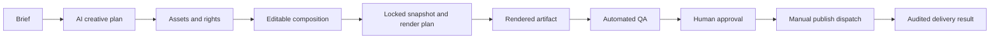

# VisionFlow — Product Completion Plan

**Status:** authoritative execution backlog for a complete product  
**Audience:** product lead, implementation agents, reviewers and release operator  
**Supersedes:** no architecture decision. This document sequences the approved
scope in the Delivery Plan, Master Execution Playbook, Composition Next Phases,
UI System and Acceptance/Operations Runbook.

## 1. Outcome and completion rules

VisionFlow is a web-operated AI-video production system. Its primary V1
outcome is not a polished screen or a queued job: an authenticated operator
creates one short video, reviews a real rendered artifact, approves it, and
optionally sends it once to an allow-listed destination. Every outcome is
organization-scoped, durable, auditable and reproducible.

### Non-negotiable Definition of Done

A backlog item is complete only when all applicable conditions hold:

1. **Authoritative state:** the Control Plane writes PostgreSQL through an
   application use case; browser, worker and Telegram do not mutate business
   tables directly.
2. **Contracted behavior:** input/output schemas, authorization, tenancy,
   idempotency, errors and events are specified and tested.
3. **Real runtime:** no mock is displayed as a finished artifact, preview,
   provider result, progress state or publishing result.
4. **Failure safety:** cancellation, duplicate delivery, restart, timeout and
   dependency failure have an explicit recovery/result state.
5. **Evidence:** automated tests plus a staging acceptance record prove the
   critical user outcome. A build, unit test, or attractive UI alone is not
   acceptance evidence.
6. **Operations:** logs, trace IDs, metrics, alert/runbook and rollback or
   forward-recovery policy exist before production enablement.

## 2. Scope boundary

### V1 — required product

- On-demand vertical short-form creation, 9:16 first.
- Self-hosted user authentication, organizations, roles and audit trail.
- Versioned prompt administration and server-side AI planning.
- Asset ingestion, provenance/rights validation, TTS/captions and a durable
  short render artifact stored in R2.
- Versioned creative document and composition timeline with real persistence.
- Automated QA, mandatory human review and manual allow-listed dispatch.
- Staging-to-production operations, monitoring, recovery and release evidence.

### Explicitly later, never hidden as V1 functionality

- Long-form editing/rendering UI and chapter execution (V2).
- Calendar, batch/campaign generation, auto-publish and autonomous release.
- Multi-account fleet/proxy controls, advanced analytics and optimization loop.
- WebGL/Wasm in core editor paths. It remains optional progressive enhancement.

## 3. Architecture invariants

| Boundary | Required rule |
| --- | --- |
| System of record | Neon PostgreSQL is canonical. Alembic owns schema changes. |
| Control Plane | FastAPI application is the only business-state writer. |
| Asynchronous work | State transition + outbox are atomic; Redis Streams workers consume commands and return typed results through APIs. |
| Workers | Execute provider/render work only. No direct PostgreSQL or legacy MySQL state writes. |
| Browser | Uses authenticated versioned APIs only; no provider/private keys, raw storage paths or fictional state. |
| Media | R2 object key + checksum + metadata + provenance; never local filesystem paths in domain records. |
| Security | Organization policy applies in every repository/use case. Service identities use least scopes. |
| Versions | Prompt, creative document, composition, render plan, QA rules and approval are immutable/referential at render time. |

## 4. Execution order and hard gates

Work may be parallelized only inside a workstream after its listed dependency
is green. Do not start a downstream production feature by stubbing an upstream
contract.

| Gate | Workstreams that must pass | Unlocks |
| --- | --- | --- |
| G0 | FND-01 to FND-04 | Reliable implementation work |
| G1 | ID-01 to ID-04, WF-01 to WF-04 | Authenticated short workflow creation |
| G2 | AI-01 to AI-05, AS-01 to AS-05 | Editable, rights-safe creative plan |
| G3 | CMP-01 to CMP-06, RND-01 to RND-07 | Real short artifact and preview |
| G4 | QA-01 to QA-04, REV-01 to REV-03 | Governed approval |
| G5 | PUB-01 to PUB-05 | Test-channel manual delivery |
| G6 | OPS-01 to OPS-09 | Production launch |
| G7 | LON-01 to LON-07 | V2 long-form enablement |

## 5. Foundation and delivery system — G0

### FND-01 Repository and contract ownership

- Publish one source-of-truth map for Studio, Control Plane, workers, intake,
  contracts and infrastructure.
- Introduce generated OpenAPI/event-contract artifacts or an equivalent
  versioned contract package; remove duplicated client-only “server” types.
- Enforce dependency boundaries: domain/application layers cannot import web,
  ORM, cloud SDK or framework objects.

**Accept:** a clean checkout builds all services; contract compatibility tests
accept additive changes and reject breaking ones.

### FND-02 Local verification and CI

- Provide one documented command set: type/lint/unit, contract, migration,
  browser E2E and staging smoke.
- PR CI runs Python/TypeScript checks, disposable Postgres migration chain,
  event/API contracts, frontend build and fixture E2E.
- CI builds non-root images, scans tracked secrets/dependencies and publishes
  immutable SHA/image evidence.

**Accept:** local and CI produce the same pass/fail result for an intentionally
broken contract, migration and type error.

### FND-03 Environments and secret management

- Separate local, staging and production Neon branches/databases, Redis,
  buckets/prefixes, AI credentials and test publishing identities.
- Use Render/Vercel secrets only; browser variables are public and contain no
  private key, provider token or database URL.
- Add configuration validators that fail closed and redact secrets.

**Accept:** a deployment with a missing required setting fails before work is
consumed; no secret is printed by health checks, CI or logs.

### FND-04 Deployment and migration discipline

- Run forward-only Alembic migrations through `MIGRATION_DATABASE_URL`; use
  pooled `DATABASE_URL` only at runtime.
- Build isolated services for Control Plane, relay, intelligence worker, media
  worker and optional legacy intake. Do not combine workers with the public
  frontend process.
- Maintain Docker runtime health semantics and rollback application images
  without destructive database rollback.

**Accept:** disposable upgrade/re-upgrade passes; each deployed service has a
truthful readiness endpoint; staging deploy uses the exact candidate SHA.

## 6. Identity, tenancy, workflow and audit — G1

### ID-01 User/session security

- Registration, login, logout, password-reset/rotation policy, Argon2id
  hashes, revocable refresh sessions, rate limiting and secure transport.
- Owner/admin MFA before public production access; recovery codes and audit
  policy must be defined before enabling it.

### ID-02 Organization and authorization model

- Roles: owner, administrator, editor, reviewer, viewer and scoped service
  identities. Enforce policy in use cases/repositories, not button visibility.
- First-owner bootstrap is single-use and audited; membership lifecycle and
  deactivation cannot strand an organization.

### ID-03 Audit trail

- Append-only events for identity, prompt, asset rights, lock, render, QA,
  approval, publish, replay and credential-access actions.
- Filtered, paginated organization audit read model with safe redaction.

### WF-01 Workflow state machine

- Define allowed states and transitions from `DRAFT` through planning, asset
  collection, rendering, QA, review, approval, dispatch, terminal failure or
  cancellation.
- State transitions own retry/cancel rules; no worker may overwrite state.

### WF-02 Outbox, Streams and DLQ

- Atomically persist command intent/outbox event with state changes.
- Relay to Redis Streams using consumer groups, manual acknowledgement,
  deterministic idempotency and XAUTOCLAIM/replay safeguards.
- DLQ events retain original event ID, reason, actor and trace ID; only an
  authorized operator may replay.

### WF-03 Worker callback and progress model

- Scoped service-token result endpoints, context lookup and attempt-aware
  idempotency. Emit progress events/read models for browser consumption.
- Browser reconnects from server state; optimistic UI is visibly pending.

### WF-04 Failure/recovery matrix

- Test duplicate HTTP command, duplicate stream message, stale attempt,
  worker crash, Redis outage, Neon outage, provider timeout and cancellation.

**G1 accept:** cross-organization attempts are safely denied; a worker restart
does not duplicate state/artifact; every mutation has trace and audit evidence.

## 7. Creative AI and prompt governance — G2 part A

### AI-01 Prompt registry

- Organization-scoped prompt templates, immutable versions, draft/evaluate/
  promote/rollback workflow and role policy.
- Pin prompt version, provider, model, generation settings and policy version
  to every run. Never embed mutable prompt text directly in a worker task.

### AI-02 Planning provider abstraction

- Define `AiPlanningProvider` port; Gemini and later providers are adapters.
- Run model calls asynchronously server-side with bounded retry, cost/latency
  accounting, safe structured-output validation and provider error mapping.

### AI-03 Brief-to-plan workflow

- Validate brief, brand constraints, target language, duration, voice,
  platform and format profile.
- Generate schema-valid script, scene list, visual prompts, captions and
  narration metadata. Human may edit before lock.

### AI-04 Safety and quality controls

- Reject malformed/unsafe provider output before persistence; show a useful
  retryable/non-retryable reason.
- Add prompt evaluation fixtures and golden structured-output cases; no paid
  provider is called in unit/CI tests.

### AI-05 Cost governance

- Provider/model allow-list, per-organization budget/quotas, token/cost
  telemetry and circuit breaker for outage/spend anomalies.

**Accept:** changing a promoted prompt does not alter an existing run; each
creative plan resolves immutable provider/prompt metadata and validates before
the editor receives it.

## 8. Asset, brand and media supply chain — G2 part B

### AS-01 Asset model and storage contract

- `MediaAsset` records organization, object key, checksum, content type,
  size, duration, dimensions, provenance, rights status and lifecycle state.
- Signed upload intents plus checksum finalization. Browser never receives R2
  credentials or arbitrary object keys.

### AS-02 Upload and validation pipeline

- MIME/size/duration/dimension validation, malware scanning for user uploads,
  metadata extraction and duplicate checksum policy.
- Temporary uploads expire; finalized media is immutable/referential.

### AS-03 Rights, brand kit and font policy

- Require asset/music license and usage context before lock; rights failure
  blocks render.
- Versioned brand kit (colors, typography, captions, logo constraints) and a
  controlled renderer font registry.

### AS-04 Asset acquisition adapters

- Provider adapters for permitted stock/generated assets; store provenance,
  provider reference, prompt and license terms.
- AI/asset provider keys remain server-side and providers are allow-listed.

### AS-05 Asset library UI

- Search/filter real assets, signed preview, rights state, upload progress,
  error/retry and selection into composition.

**Accept:** a wrong checksum, foreign object key or unknown rights cannot be
locked or rendered; a worker restart can still retrieve every finalized input.

## 9. Composition Studio and professional editing — G3 part A

### CMP-01 Durable composition data

- Versioned document, tracks, clips, effects and keyframes with expected
  revision/optimistic conflict handling. Only locked versions can render.
- Validate organization asset references, timing/trim ranges, effect schema
  and format profile before persistence.

### CMP-02 Typed effect registry

- Registry defines key, target types, JSON schema, capability/version and
  deprecation. Unknown/invalid effect configuration returns 422.
- Supported V1 baseline: transform, scale keyframes, cinematic push, impact
  shake, caption pop, soft glow and motion blur.

### CMP-03 Truthful Studio surface

- Real timeline, track/clip selection, trim/timing, effect inspector, lock
  flow, save/conflict/error states and server reload restoration.
- Do not label the layout canvas as rendered preview. Display capability as
  `layout`, `partial` or `rendered` from the backend.

### CMP-04 Editor interaction quality

- Command-based local history: move, trim, split, transform, effect and
  keyframe commands; undo/redo before autosave.
- Debounced autosave (750–1200ms), explicit saving/saved/conflict/offline,
  flush on lock/navigation; no silent overwrite.
- Keyboard alternatives for every drag action, visible focus, screen-reader
  feedback, 200% zoom and reduced-motion support.

### CMP-05 Effects, caption, overlay and audio editing

- Real asset picker and overlay/text clips; transform, crop, opacity, rotate,
  blend and multi-property keyframes.
- Audio gain, fades, loop, timing and voice ducking. Captions use the
  controlled font/brand registry.

### CMP-06 Composition review/version comparison

- Revision compare, duplicate/unlock policy, comment pins and reviewer view.
- Locked snapshots are immutable; new edits create a draft revision.

**Accept:** a user can reproduce an edited timeline after reload, use it with
keyboard only, resolve a concurrent edit conflict and lock the exact revision
that the renderer receives.

## 10. Render, preview and artifact lineage — G3 part B

### RND-01 Render plan compiler

- Implement immutable `RenderPlan` value objects and a compiler that receives
  only a locked composition/creative snapshot.
- Produce canonical JSON and SHA-256 `render_plan_hash`; identical snapshots
  compile byte-identically. Router and React never build renderer commands.

### RND-02 Renderer strategy adapters

- Define `RenderProvider` port. Use FFmpeg filtergraph as production adapter;
  MoviePy may be a bounded fallback. GPU/cloud adapters remain interchangeable.
- Implement video/image/text/audio layers, transforms, trim, overlay, xfade,
  captions, supported effects and audio mix/duck/fades.

### RND-03 Render queue and resource controls

- Render command is idempotent, cancellable and bounded by concurrency,
  timeout, temporary storage and cost profile. API process never renders media.
- Record adapter version, FFmpeg version, inputs/checksums, duration, codec,
  peak audio, render plan hash and diagnostic/error code.

### RND-04 Durable artifact storage

- Upload temporary render then verify checksum/metadata before promoting to
  final R2 key. Generate short-lived signed preview URL from an API.
- Partial/corrupt output is never marked final; cleanup policy is observable.

### RND-05 Authoritative composition preview

- `POST composition/preview` creates a separate idempotent preview job from a
  chosen revision/range/quality. It never dispatches/publishes.
- Render at most five seconds, 540x960 initially, upload temporary R2 object
  with TTL; Studio polls server status and displays signed URL.

### RND-06 Render progress and recovery

- Worker events expose real queued/started/progress/complete/failed/cancelled
  states. Retry follows attempt policy and cannot produce duplicate artifacts.

### RND-07 Short-form end-to-end acceptance

- Execute browser brief → plan → assets → composition → lock → render → R2
  artifact on staging using real staging provider credentials.

**G3 accept:** reordered clips/timing/effect/audio visibly change the output;
artifact, inputs, creative version and plan hash are provably linked; a five
second preview is not a client placeholder.

## 11. QA, review and manual publishing — G4/G5

### QA-01 Automated media and policy QA

- Versioned rules evaluate duration/aspect/codec, black/silent frames, caption
  presence/timing, safe area, peak audio, rights, brand and policy checks.
- Store machine-readable report tied to artifact checksum and rule-set version.

### QA-02 Failure and rework loop

- QA fail blocks approval/dispatch. UI shows actionable rule failures and
  routes editor to a new draft revision without mutating locked evidence.

### REV-01 Reviewer workflow

- Reviewer sees signed artifact, QA report, lineage and diff; records an
  immutable approve/reject decision with reason and actor. Role policy applies.

### REV-02 Approval invalidation

- Policy-relevant change (artifact, composition, rights, QA or destination)
  invalidates prior approval by an explicit audited rule.

### PUB-01 Publishing adapter boundary

- Provider-specific adapters run asynchronously behind a `Publisher` port;
  tokens are envelope-encrypted and access is audited.

### PUB-02 Manual dispatch gate

- Dispatch only an approved artifact to a selected allow-listed destination.
  No calendar, batch or auto-publish in V1.

### PUB-03 Idempotent publication attempts

- One provider dispatch key, explicit attempt state, timeout reconciliation and
  no “published” claim without provider confirmation.

### PUB-04 Channel/token management

- OAuth connection, token expiry/rotation, revoke/disconnect, least channel
  scope and test-channel separation.

### PUB-05 Dispatch UI and audit

- Clear destination, approval, attempt state, provider reference/error and
  retry/reconcile action. Do not expose credentials.

**G5 accept:** QA reject blocks approval; approval blocks unauthorized or
changed inputs; a simulated provider timeout reconciles one existing attempt
instead of creating a duplicate external post.

## 12. Product UI, accessibility and design system — applies throughout

### UX-01 Prism Flow system

- Implement tokenized color/type/spacing/elevation/focus/motion system and
  reusable semantic components. Retire decorative terminal/cyber effects.
- Focus Canvas, Signal Rail and Context Rail show real workflow state only.

### UX-02 Complete product surfaces

- Control Tower: real active workflow and exception queue.
- Create Short: brief, plan and format/brand constraints.
- Asset Library: upload/rights/selection.
- Composition Studio: the capabilities in CMP-01–06.
- Prompt Registry: version/evaluation/promotion.
- Review & Publish: real signed artifact, QA, decision and dispatch state.

### UX-03 Accessibility/performance

- Keyboard, screen reader labels, focus management, reduced motion, 200% zoom,
  responsive small-screen fallback and WCAG 2.2 AA checks.
- Performance budgets: no WebGL requirement in work loop; LCP <= 2.5s and
  CLS <= 0.1 on the staging reference profile; timeline handler work <16ms for
  normal 20-track/100-clip project.

**Accept:** no control or visual state makes a claim the server cannot prove;
critical creation/review paths pass keyboard-only and reduced-motion E2E.

## 13. Production operations, security and launch — G6

### OPS-01 Observability

- OpenTelemetry trace/log/metric correlation across API, relay, workers and
  provider calls. Propagate trace IDs through HTTP and events.
- Dashboards: API, auth, queue age/DLQ, workflow success, render latency/cost,
  provider failures, Neon, R2 and publication attempts.

### OPS-02 Alerts and SLOs

- Alert on queue age, retry exhaustion, render failure, auth abuse, database/
  Redis/R2 outage and cost anomaly. Define on-call ownership and escalation.
- Track V1 goals: 95% accepted short runs hit declared SLA; 0 duplicate
  publications; 100% mutation audit/lineage coverage.

### OPS-03 Security verification

- OWASP ASVS Level 2 checklist, CORS/security headers/CSRF as applicable,
  request limits, secret/dependency scan, least CI permissions, admin MFA,
  penetration review and credential rotation drill.

### OPS-04 Data resilience

- Neon backup/recovery point and restore rehearsal; forward-compatible
  migration policy; R2 retention/lifecycle manifest and recovery procedure.

### OPS-05 Incident runbooks

- `render-stalled`, worker crash, Redis/Neon/R2 failure, provider outage,
  malformed event, QA defect, publish ambiguity and credential rotation.

### OPS-06 Staging acceptance pack

- Execute and save evidence for A1–A6 in the Acceptance Runbook: tenancy,
  planning, asset rights, composition, render/recovery, QA/approval/dispatch.

### OPS-07 Release controls

- Candidate SHA/image digest, migration revision, secrets-name checklist,
  independent approval, backward-compatible rollback plan and post-deploy
  synthetic short workflow with publishing disabled.

### OPS-08 Production launch

- Deploy control plane/migration/relay/workers in dependency order; verify
  readiness then synthetic run. Enable traffic gradually and monitor the
  observation window before broad access.

### OPS-09 Post-launch support

- Error triage ownership, release notes, support/export/deletion policy and
  periodic cost/security/reliability review.

**G6 accept:** staging A1–A6 passes with trace evidence; backup restore and
failure drills pass; production launch approver signs the release record.

## 14. Long-form V2 — G7, only after V1 gates are green

### LON-01 Format profile extension

- Add long-form profile limits and validation without a new database/control
  plane model.

### LON-02 Multi-act planning

- Acts, chapters, research/source references and pacing constraints compile to
  the same versioned Creative Document contract.

### LON-03 Chapter composition and render

- Chapter/segment child jobs, resumable render, per-segment QA and controlled
  join. One failed segment rerenders independently.

### LON-04 Long-form editor

- Virtualized timeline, chapter navigation, proxy media, waveform/thumbnails
  and performance ceiling appropriate to large projects.

### LON-05 Long-form QA/review

- Chapter plus final artifact QA, cumulative rights/approval lineage and
  format-specific cost/concurrency budgets.

### LON-06 Long-form acceptance

- Create multi-act project, fail/retry a segment, join, review and prove parent
  to child lineage without changing the short-form contracts.

### LON-07 Scale and cost controls

- Queue classes, concurrency quotas, GPU/CPU routing, storage lifecycle and
  cost estimates before accepting large workloads.

## 15. Work explicitly not to start before its gate

| Do not start | Until |
| --- | --- |
| Public production sign-up | ID security, MFA and rate-limit acceptance |
| Render preview UI labelled “real” | RND-05 produces signed server artifact |
| Rich effects/audio UI | RND-01/02 typed compiler and renderer support exist |
| Production publishing | QA/review, encrypted token and test-channel evidence pass |
| Long-form UI | G6 is complete and V1 short workflow is stable |
| Analytics/AI layout adaptation | trusted publication/read-model data exists |
| WebGL/Wasm in editor | DOM editor accessibility and performance gates pass |

## 16. Immediate execution sequence from the current baseline

The current code has real foundations for short workflow creation, versioned
creative/composition persistence, basic timeline interactions, auth and the
isolated intake runtime. It does **not** yet prove an end-to-end browser-to-MP4
short workflow; the immediate work must close that gap before adding breadth.

1. **S1 — Staging runtime parity:** deploy Control Plane, relay and
   intelligence/media workers with Neon, Redis, R2 and provider secrets;
   complete FND-03/04 evidence.
2. **S2 — Real short vertical slice:** run RND-07 with one browser-created
   short workflow. Capture workflow/trace/artifact IDs and fix every missing
   API/event/provider contract uncovered.
3. **S3 — Render-plan and preview:** complete RND-01–05 so the editor preview
   becomes authoritative, then label/remove the current layout-only preview.
4. **S4 — Editor completion:** complete CMP-04/05/06 (history, keyboard,
   autosave/conflicts, overlays, captions and audio) against the renderer.
5. **S5 — QA/review/publish:** complete QA/REV/PUB and stage a test-channel
   dispatch. Keep auto-publish out of scope.
6. **S6 — Release readiness:** execute OPS-01–09 and promote only with the
   full evidence pack.
7. **S7 — V2 long-form:** start LON-01 only after S1–S6 have passed.

## 17. Required evidence ledger

For each completed item, record in a release artifact:

| Field | Required content |
| --- | --- |
| Backlog ID | e.g. `RND-05` |
| Candidate | Git SHA, image digest and migration revision |
| Contract | API/event schema and compatibility test |
| Automated evidence | exact command, test count/result and CI URL |
| Staging evidence | workflow ID, trace ID, artifact/preview ID (redacted URL) |
| Failure evidence | at least one relevant negative/recovery case |
| Security/tenancy | policy test or review reference |
| Operator | reviewer and release owner |
| Decision | accepted, blocked, rollback/forward action |

No item may be marked done without this ledger. If a dependency is missing,
mark the item **blocked**, not complete.
